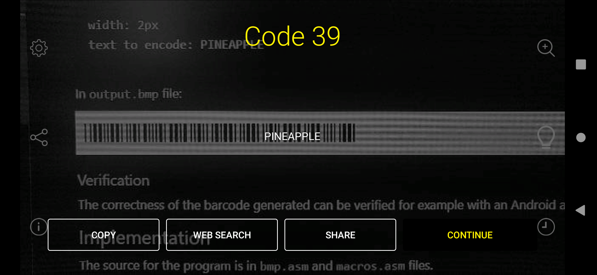
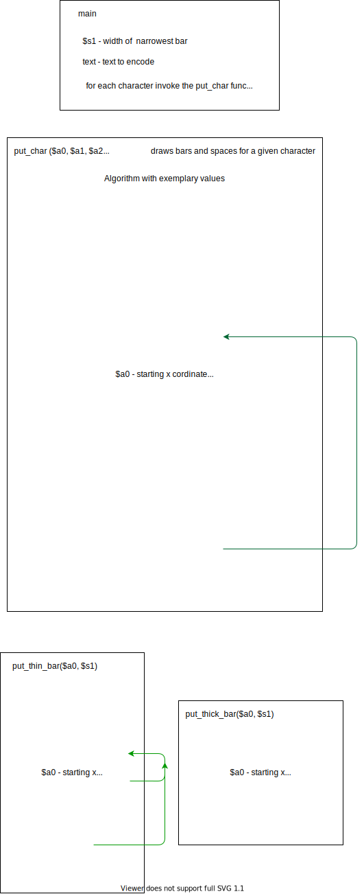

# Barcode generator

## About 
This program generates a [Code 39](https://en.wikipedia.org/wiki/Code_39) barcode for a given string. In other words, it draws the appropriate sequences of bars and spaces into a bmp file. Additionally, the barcode contains a checksum. 

Details of the task can be found in `task.pdf` file.

## How to run
Put all the files in one folder. Run `Mars4_5.jar` program. Given that you have Java installed on your computer, MARS should launch.
1.  Click `F3` to assemble and `F5` to run the program. 
2.  In the `Run I/O` window type the inputs requested.
3.  A barcode will be generated in the `output.bmp` file.

## Sample run
Inputs:

    width: 2px
    text to encode: PINEAPPLE

In `output.bmp` file:

The correctness of the barcode generated can be verified for example with an Android app:

The `checksum` option must be enabled in a barcode scanner in order for the decoding to occur properly.

## Implementation
The source for the program is located in `bmp.asm` and `macros.asm` file. It is written in Mips assembly language. The simplified logic of the core functions in pseudocode is presented in form of diagrams below:

 